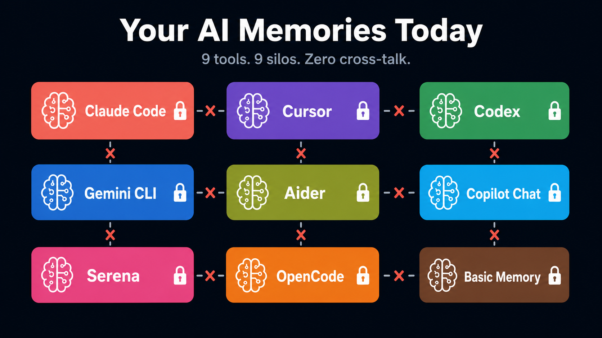
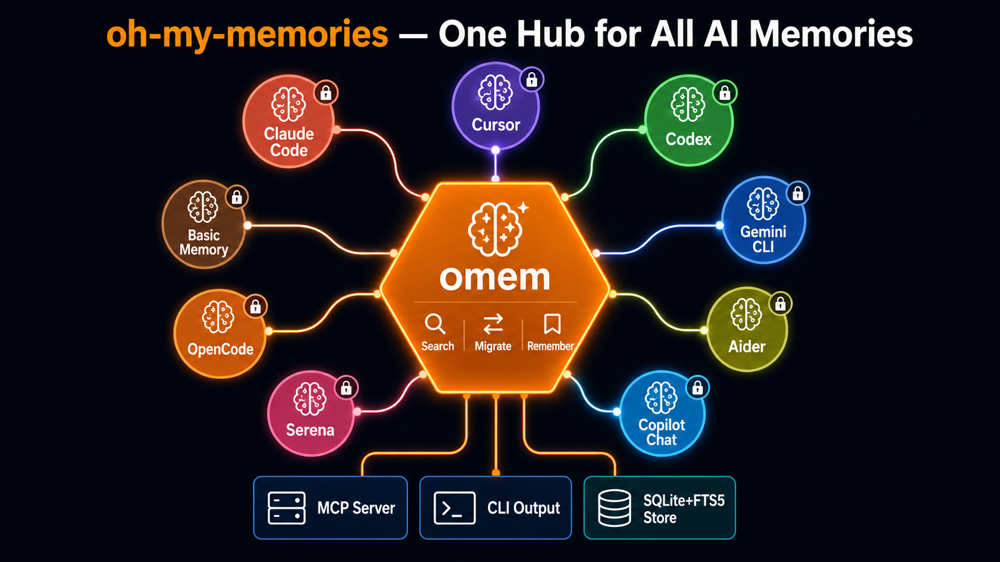
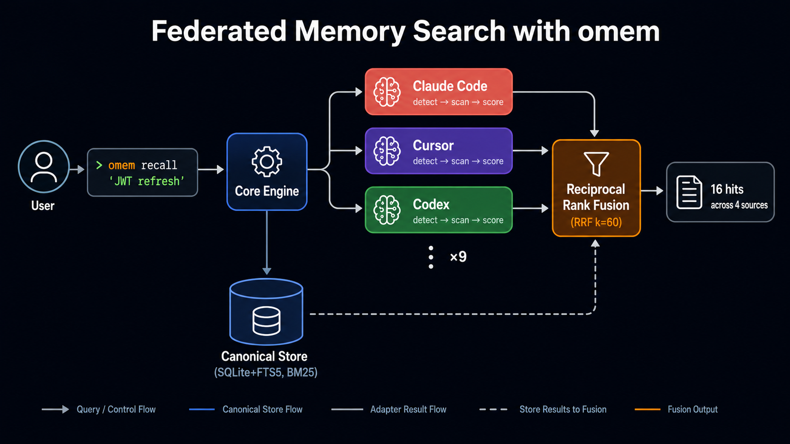

# oh-my-memories

> **The cross-tool memory layer for AI coding agents.**
> One CLI to manage, search, and migrate memories across Claude Code, Cursor, Codex, Gemini CLI, Aider, Copilot Chat, Serena, OpenCode, and Basic Memory.

[]()
[]()
[]()
[]()

---

## The Problem

You discuss a JWT refresh flow in Claude Code. It remembers. A week later you open Cursor and ask the same question — blank stare. The memory exists in `~/.claude/projects/`, but Cursor doesn't know that folder exists.

Now multiply by **9 tools**, **6 months** of conversations. Your knowledge is scattered across isolated silos that no single agent can see.



**Every tool only sees its own memory.** No cross-tool search. No migration. No backup.

## The Solution

**oh-my-memories** (`omem`) is the hub that connects all your AI memory silos.



```bash
$ npm install -g oh-my-memories
$ omem init                                    # auto-detects every memory source
$ omem scan
 Source         Records  Status
 claude-code      1,247  ✓ detected
 cursor             832  ✓ detected
 codex              415  ✓ detected
 gemini-cli         203  ✓ detected
 aider               67  ✓ detected
 copilot-chat       341  ✓ detected
 serena              28  ✓ detected

$ omem recall --all "JWT refresh flow"         # federated search across ALL tools
 16 hits across 4 sources (BM25 + RRF)
```

## How It Works



**Key design decisions:**

- **Adapters are read-only and independent** — each adapter only depends on the SDK types, not on `core` or other adapters
- **Federation via RRF** — BM25 scores from each source are merged using Reciprocal Rank Fusion (k=60) for stable, unbiased ranking
- **Plugin ecosystem** — third-party adapters install from npm (`@omem-adapter/*`) against a stable 1.0.0 SDK

## Supported Adapters

| Adapter             | Source                                            | Format                  | Category  |
| ------------------- | ------------------------------------------------- | ----------------------- | --------- |
| **Claude Code**     | `~/.claude/projects/*.jsonl`                      | JSONL                   | AI IDE    |
| **Cursor**          | `~/.cursor/projects/*/agent-transcripts/*.jsonl`  | JSONL                   | AI IDE    |
| **Codex**           | `~/.codex/sessions/*.jsonl`                       | JSONL                   | AI IDE    |
| **Gemini CLI**      | `~/.gemini/tmp/<hash>/chats/*.jsonl`              | JSONL                   | AI IDE    |
| **Aider**           | `.aider.chat.history.md` (per-project)            | Markdown                | AI IDE    |
| **Copilot Chat**    | VS Code `workspaceStorage/*/chatSessions/*.jsonl` | JSONL (mutation replay) | AI IDE    |
| **Serena**          | `.serena/memories/*.md` (per-project)             | Markdown + YAML         | MCP       |
| **OpenCode**        | `~/.local/share/opencode/` sessions               | JSON                    | AI IDE    |
| **Basic Memory**    | `~/basic-memory/**/*.md`                          | Markdown + YAML         | MCP       |
| **Plugin adapters** | `@omem-adapter/*` from npm                        | Any                     | Community |

## Quick Start

```bash
# Install
npm install -g oh-my-memories          # or: bun add -g oh-my-memories

# Initialize — auto-detects sources, writes ~/.omem/config.json
omem init

# Inventory — what's on this machine?
omem scan

# Federated search — query across all tools at once
omem recall --all "websocket reconnect"

# Teach your IDE agent to use omem
omem skills install --ide=cursor       # or: claude / codex / gemini

# Wire as MCP server — IDE agents call omem as a tool
omem mcp install --ide=cursor          # supports: claude / cursor / codex / gemini
```

## Features

### Search & Discovery

| Command                       | What it does                                    |
| ----------------------------- | ----------------------------------------------- |
| `omem scan`                   | Inventory every memory source on your machine   |
| `omem recall --all "<query>"` | Federated BM25+RRF search across all sources    |
| `omem stats`                  | Per-source record counts and health at a glance |
| `omem watch`                  | Monitor source files, auto-rescan on change     |

### Memory Management

| Command                              | What it does                                        |
| ------------------------------------ | --------------------------------------------------- |
| `omem remember "<text>"`             | Write to the local canonical store (SQLite+FTS5)    |
| `omem prune --older-than 90d`        | Clean up canonical store (age + dedup)              |
| `omem migrate --from cc --to cursor` | Move memories between tools (dry-run by default)    |
| `omem export --all`                  | Portable `.tar.gz` backup of all home-based sources |
| `omem import backup.tar.gz`          | Restore from backup                                 |

### Integration

| Command                                | What it does                                                   |
| -------------------------------------- | -------------------------------------------------------------- |
| `omem mcp serve`                       | Start MCP server (IDE agents call `omem_recall` / `omem_scan`) |
| `omem mcp install --ide=cursor`        | Wire MCP server into IDE config                                |
| `omem skills install --ide=cursor`     | Install a SKILL.md that teaches the agent to use omem          |
| `omem adapter install @omem-adapter/x` | Install community adapters from npm                            |
| `omem adapter search`                  | Find adapters on npm registry                                  |

### Maintenance

| Command        | What it does                                        |
| -------------- | --------------------------------------------------- |
| `omem init`    | First-time setup (detects sources, writes config)   |
| `omem doctor`  | Health check (versions, adapters, schema, denylist) |
| `omem upgrade` | Self-update from npm                                |
| `omem config`  | View/edit configuration                             |

## Why Not Just Use mem0 / Letta / Zep?

Those tools are **engines** — they store memory. We are a **hub** — we manage memory that already exists across all your tools, **including theirs**.

|                         | Memory Engines (mem0, Letta, Zep) | oh-my-memories                             |
| ----------------------- | --------------------------------- | ------------------------------------------ |
| **Role**                | Store & retrieve memory           | Federate & migrate existing memory         |
| **Cross-tool**          | No — each is its own silo         | Yes — reads from 9+ sources at once        |
| **Own engine**          | Yes (primary purpose)             | Yes (M3+, for tools without native memory) |
| **Integration breadth** | 1 store                           | 9 built-in adapters + plugin ecosystem     |

Read [`docs/PRODUCT.md`](./docs/PRODUCT.md) for the full thesis.

## What's Next (M7+)

- Semantic search (`sqlite-vec` embeddings + RRF)
- Memory provenance / "show why" tracing
- Team / shared memory store (server mode)
- Web UI for browsing memories
- Cross-machine sync
- Cat C adapters for mem0 / Letta / Zep / Cognee

See [`docs/ROADMAP.md`](./docs/ROADMAP.md) for the full roadmap.

## Project Layout

```text
oh-my-memories/
├── packages/cli/          — omem binary, commands, plugin loader
├── packages/core/         — storage engine (SQLite+FTS5), retrieval, federation (RRF)
├── packages/mcp/          — MCP server (omem_recall + omem_scan tools)
├── packages/adapter-sdk/  — adapter interface (1.0.0 stable)
├── packages/adapters/     — 9 built-in adapters + shared utils
├── skills/                — IDE-specific SKILL.md packs
├── docs/                  — product docs, architecture, adapter SDK guide
├── specs/                 — design decisions and review verdicts
└── tests/                 — e2e and integration tests
```

For AI agents opening this repo: read [`AGENTS.md`](./AGENTS.md) first.

## Status

**Beta** — M0.5 through M6 complete. 529 tests, 0 failures. Version `0.1.0-beta.1`.

Install: `npm install -g oh-my-memories@beta`

## Contributing

See [`CONTRIBUTING.md`](./CONTRIBUTING.md). Adapter contributions especially welcome — see [`docs/ADAPTER-SDK.md`](./docs/ADAPTER-SDK.md).

## License

MIT. See [`LICENSE`](./LICENSE).

## Acknowledgments

Inspired by [oh-my-zsh](https://github.com/ohmyzsh/ohmyzsh) and [oh-my-codex](https://github.com/ZachJW34/oh-my-codex).
